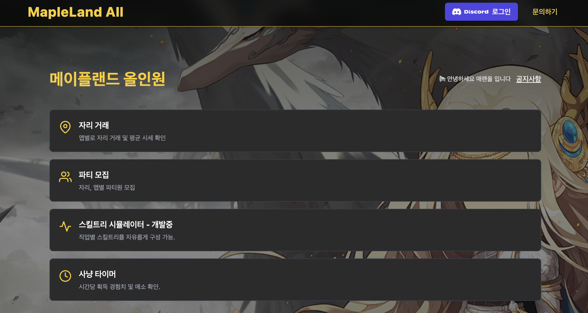
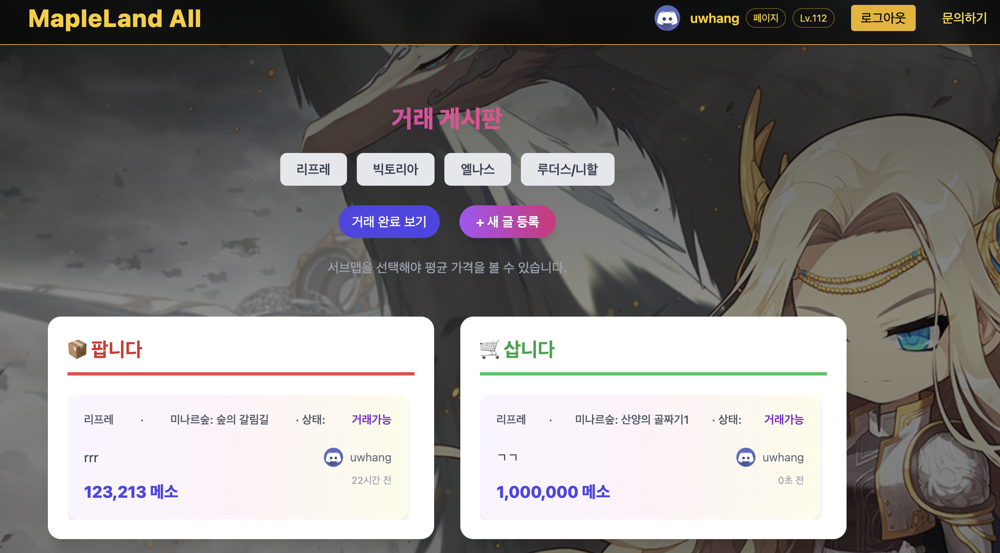

### 🍞메랜 올
메이플랜드 유저를 위한 개인 프로젝트 웹앱입니다. 스킬트리 시뮬레이터, 자리 거래 게시판, 파티 모집/신청 기능을 구현하였으며
Next.js + TypeScript 기반으로 제작했고, Discord 로그인 연동으로 원만한 모집 환경을 제공합니다. 필터·검색, 평균 시세, 마이페이지 관리 등 실제 사용 흐름에 맞춘 UI/UX를 구현했습니다.

프로젝트 링크 : https://www.maland-all.co.kr/

### ⚡Tech 


### ⚡View 
| 메인 | 자리거래 | 파티모집 |
| :-: | :-: | :-: |
|  |  |  |

## 📣Focus
* Next.js + TypeScript: CSR/ISR 조합으로 빠른 반응성, 타입 안정성 확보

* Discord 로그인: 디스코드 기반의 거래/모집 환경

* 자리 거래 게시판: 맵/서브맵/유형 필터, 평균 시세 표시, 거래 진행 상태 관리

* 파티 모집: 커스텀 자리 선택, 파티 신청자 리스트 관리

* 스킬트리 시뮬레이터: 1~4차, 선행 스킬, 총 SP 계산, 직업/레벨 변경 시 실시간 반영

* 마이페이지: 내 거래글/파티글 관리, 상태 변경·삭제, 신청 목록 확인

* 반응형 UI: Tailwind로 모바일·데스크톱 최적화


### ⚡Code View 
---
<br>


<br>

```
"use client";
import { createContext, useContext, useEffect, useState } from "react";
import axios from "axios";

type User = { discordId: string; username: string; avatar?: string; job?: string; level?: number };
const AuthCtx = createContext<{ user: User | null; refresh: () => Promise<void> }>({ user: null, refresh: async () => {} });

export function AuthProvider({ children }: { children: React.ReactNode }) {
  const [user, setUser] = useState<User | null>(null);

  const refresh = async () => {
    try {
      const { data } = await axios.get("/api/auth/me");
      setUser(data);
    } catch {
      setUser(null);
    }
  };

  useEffect(() => { refresh(); }, []);
  return <AuthCtx.Provider value={{ user, refresh }}>{children}</AuthCtx.Provider>;
}
export const useAuth = () => useContext(AuthCtx);

```
> 앱 전역에서 유저의 직업 레벨 등의 변경 사항이 Nav / MyPage / 리스트에 즉시 반영되도록 컨텍스트로 관리했습니다.


<br>

---

<br>


<br>

```
import express from "express";
import Trade from "../models/Trade";
const router = express.Router();

// 평균 시세 (맵/서브맵 기준)
router.get("/avg", async (req, res) => {
  const { mapName, subMap } = req.query as { mapName?: string; subMap?: string };
  const pipeline: any[] = [
    ...(mapName ? [{ $match: { mapName } }] : []),
    ...(subMap ? [{ $match: { subMap } }] : []),
    { $group: { _id: { mapName: "$mapName", subMap: "$subMap" }, avgPrice: { $avg: "$price" }, count: { $sum: 1 } } },
    { $sort: { "_id.mapName": 1, "_id.subMap": 1 } }
  ];
  const result = await Trade.aggregate(pipeline);
  res.json(result);
});

// 거래 상태 변경 (대기 → 거래중 → 거래완료/취소)
router.patch("/:id/status", async (req, res) => {
  const { status } = req.body; // "거래중" | "거래완료" | "거래취소"
  const trade = await Trade.findByIdAndUpdate(req.params.id, { status }, { new: true });
  res.json(trade);
});

export default router;

```

> 거래글 목록에는 평균 시세 / 최대가격과 최소가격을 함께 노출해 합리적 가격 결정을 돕습니다

<br>

---

<br>

```
export function getMaxSPByTier(jobId: string, level: number) {
  const isMage = jobId.toLowerCase() === "mage";
  const gates = { first: isMage ? 8 : 10, second: 30, third: 70, fourth: 120 };
  const bonus = (lv: number, start: number, end = lv) => Math.max(0, Math.min(end, lv) - start + 1);
  return {
    t1: level >= gates.first ? 1 + bonus(level, gates.first + 1, Math.min(level, 30)) : 0,
    t2: level >= gates.second ? bonus(level, 31, Math.min(level, 70)) : 0,
    t3: level >= gates.third ? bonus(level, 71, Math.min(level, 120)) : 0,
    t4: level >= gates.fourth ? bonus(level, 121, level) : 0,
  };
}

```
> 1~4차 전직 구간에 따라 차수별 최대 SP를 계산하고, 선행 스킬 조건을 만족하지 않으면 투자 불가하도록 UI에서 제어합니다.